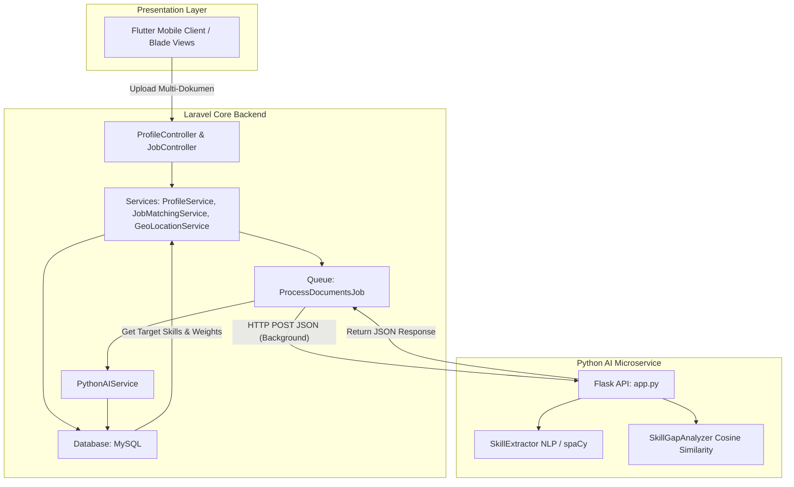

# 📊 Dokumentasi Komprehensif: Modul AI Matching v2 (KompasKarir)

Dokumen ini merupakan panduan lengkap dan terintegrasi mengenai sistem kecerdasan buatan, arsitektur *microservice*, struktur database, alur program, formula matematika, hingga alat diagnostik pada modul **AI Matching** (Mesin Pencocokan AI / *AI Recommendation Engine*) di platform **KompasKarir**.

---

## 🏗️ KELOMPOK 1: GAMBARAN UMUM & ARSITEKTUR SISTEM (System Architecture)

Aplikasi KompasKarir menggunakan pendekatan **Arsitektur Hybrid (Decoupled Microservice)** dengan pola **Dua Tahap (Pre-compute + Lazy Resolve)**. Arsitektur ini dirancang untuk memisahkan beban kerja pemrosesan dokumen yang berat dari siklus *request-response* utama Laravel demi menjaga performa aplikasi tetap cepat dan responsif.

### 1. Pembagian Peran Komponen Utama
*   **Laravel Backend (Core Engine):**
    *   Bertindak sebagai server utama dan pengelola logika bisnis aplikasi.
    *   Mengatur antrean pekerjaan (*Asynchronous Queue Job* melalui `ProcessDocumentsJob`) agar proses parsing dokumen berjalan di latar belakang.
    *   Menyediakan API untuk aplikasi klien Flutter serta merender halaman web berbasis Blade untuk sisi Administrator.
*   **Python Flask Server (AI Microservice):**
    *   Berperan khusus sebagai mesin kecerdasan buatan (*AI Engine*).
    *   Bertanggung jawab untuk menangani pemrosesan bahasa alami (NLP) dengan *library* spaCy, pembacaan berkas (CV, Sertifikat, Portofolio), pencocokan pola (*Pattern Matching*), dan ekstraksi vektor (*Skill Embeddings*).
*   **Frontend (Flutter App & Blade Views):**
    *   Menyediakan antarmuka interaktif bagi pelamar untuk mengunggah multi-dokumen (hingga 5 jenis dokumen secara paralel) serta menampilkan indikator proses secara *real-time*.

### 2. Diagram Alur Arsitektur (Architecture Flow)
Alur interaksi antarkomponen digambarkan melalui diagram berikut:



### 3. Evaluasi Kepatuhan "Laravel Best Practices"
*   **Service Layer Pattern:** Seluruh logika bisnis yang rumit dipisahkan secara rapi ke dalam *Service* khusus (seperti `GeoLocationService` dan `DocumentScoringService`).
*   **Asynchronous Processing:** Proses ekstraksi NLP yang membutuhkan waktu pemrosesan lama dijalankan melalui *Queue* agar tidak memblokir pengguna saat berinteraksi di aplikasi.
*   **Penghindaran N+1 Queries:** Pengambilan data relasional database dioptimalkan menggunakan teknik *Eager Loading* untuk memastikan efisiensi memori dan waktu eksekusi.

---

## 📂 KELOMPOK 2: STRUKTUR DATA & LAPISAN KONFIGURASI (Database & Configuration)

Untuk mendukung fungsionalitas Multi-Document dan pembobotan dinamis, database dan konfigurasi Laravel telah disesuaikan agar mampu menangani penyimpanan koordinat vektor serta pembobotan kustom per lowongan.

### 1. Struktur Database Terbaru
*   **`user_documents`:**
    *   *Fungsi:* Menyimpan data meta berkas yang diunggah oleh pengguna (misalnya CV, sertifikat, transkrip nilai, atau ijazah) beserta status pemrosesannya.
    *   *Kolom Kunci:* `id`, `user_id`, `file_path`, `document_type` (CV/Sertifikat/dll), `status` (`pending`, `processing`, `completed`, `failed`).
*   **`user_document_scores`:**
    *   *Fungsi:* Menyimpan hasil ekstraksi NLP berupa daftar kompetensi/keahlian serta nilai keyakinan (*confidence score*) dalam bentuk representasi vektor numerik.
    *   *Kolom Kunci:* `id`, `user_document_id`, `skills_json` (berisi pasangan key-value *skill* dan skor keyakinan), `vector_data`.
*   **`company_document_weights`:**
    *   *Fungsi:* Menyimpan konfigurasi pembobotan default yang ditetapkan oleh administrator sistem sebagai acuan dasar pencocokan.
*   **`job_listings` (Pembaruan Fitur):**
    *   *Fungsi:* Menyimpan data lowongan pekerjaan. Kini ditambahkan fitur pengaturan bobot dokumen secara spesifik (*Per-Lowongan*). 
    *   *Catatan:* Saat perusahaan (*Industry*) mengunggah lowongan baru, mereka dapat menggunakan referensi bobot *default* dari Admin, atau membuat konfigurasi bobot kustom yang paling sesuai dengan posisi jabatan tersebut.

### 2. Lapisan Konfigurasi & Rute Laravel
*   **`services.php` (`config/services.php`):**
    *   *Konfigurasi:* Menambahkan konfigurasi `python_api` agar Laravel dapat memanggil *microservice* Python Flask secara dinamis.
    *   *Catatan:* Konfigurasi ini mereferensikan variabel `.env` (`PYTHON_API_URL` dengan *fallback* otomatis ke `http://localhost:5000/api`).
*   **`web.php` (`routes/web.php`):**
    *   *Rute:* Menambahkan dua rute penting di bawah grup *prefix* `admin`:
        1.  `GET /admin/ai-workflow` (`admin.ai-workflow`): Untuk merender dashboard pemantauan alur AI.
        2.  `POST /admin/ai-workflow/diagnostic` (`admin.ai-workflow.diagnostic`): Untuk melayani uji coba diagnostik secara interaktif.

### 3. Service Laravel Tambahan
*   **`DocumentScoringService.php`:** Bertanggung jawab melakukan perhitungan matematika *dot product* antara vektor dokumen pelamar dengan bobot kompetensi yang diminta perusahaan.
*   **`GeoLocationService.php`:** Menggunakan *Haversine Formula* untuk menghitung jarak nyata antara koordinat GPS pelamar dengan koordinat lokasi perusahaan.

---

## ⚙️ KELOMPOK 3: MEKANISME & ALUR KERJA PROGRAM (Program Workflow)

Sistem evaluasi pencocokan kandidat dipisahkan menjadi dua tahap independen guna menjaga server tetap ringan dan responsif selama pencarian kerja.

### 🚀 Alur Kerja A: Tahap 1 - Pemrosesan Dokumen Latar Belakang (Pre-compute)
Alur ini dipicu secara asinkron ketika pengguna melakukan pengunggahan atau pembaruan berkas pada profil mereka.

```
[User Uploads Files] 
         │
         ▼
[ProfileController] ──► (Simpan berkas & Balas "Sukses" ke User)
         │
         ▼ (Lempar Tugas)
[Queue: ProcessDocumentsJob]
         │
         ▼ (HTTP POST Request)
[PythonAIService] ──► [Python Flask Server (NLP spaCy)]
                                  │
                                  ▼ (Ekstraksi Skill & Vektor)
[user_document_scores] ◄── [Kirim Balasan JSON]
```

1.  **Upload Multi-Dokumen:** Pengguna mengunggah hingga 5 jenis dokumen pendukung di halaman `/profile` aplikasi.
2.  **Dispatch Job:** Controller segera merespons "Sukses" ke pengguna (agar pengguna tidak menunggu *loading* lama), lalu melempar objek `ProcessDocumentsJob` ke dalam antrean (*Queue*).
3.  **Panggilan AI:** Pekerjaan latar belakang memanggil `PythonAIService` untuk mengirim berkas ke server Python Flask.
4.  **Penyimpanan Embeddings:** Server Flask mengekstrak informasi kompetensi lalu mengirimkan respon balik. Laravel menyimpan representasi vektor numerik hasil ekstraksi tersebut ke tabel `user_document_scores` dengan status `completed`.

### 🚀 Alur Kerja B: Tahap 2 - Penilaian & Pencocokan Lowongan (Lazy Resolve)
Tahap pencarian ini berjalan secara instan (*real-time* dengan latensi sangat rendah) karena bagian komputasi dokumen yang berat telah diselesaikan terlebih dahulu pada Tahap 1.

1.  **Cari / Detail Lowongan:** Pengguna membuka daftar lowongan atau masuk ke halaman detail lowongan.
2.  **Ambil Bobot Dinamis:** Sistem membaca konfigurasi bobot dokumen pada lowongan di tabel `job_listings`. Jika lowongan tersebut tidak memiliki bobot kustom, sistem otomatis mengambil bobot *default* rekomendasi Admin.
3.  **Kalkulasi Blended Score:**
    *   `DocumentScoringService` mencocokkan kemiripan vektor *skill* hasil NLP dokumen dengan kebutuhan posisi (Bobot Kontribusi 60%).
    *   `JobMatchingService` menggabungkan skor dokumen tersebut dengan skor tes Asesmen Mandiri yang diselesaikan kandidat secara tertulis (Bobot Kontribusi 40%).
4.  **Filter & Sorting Geolokasi:** `GeoLocationService` menghitung jarak GPS untuk memfilter lowongan dalam radius terdekat serta mengurutkan daftar lowongan berdasarkan jarak terdekat dari lokasi tinggal kandidat.

---

## 📐 KELOMPOK 4: FORMULA MATEMATIKA & ALGORITMA NLP (Mathematical Formulas & NLP Engine)

Bagian ini mendokumentasikan rumus-rumus inti yang digunakan untuk mengolah teks berantakan pada CV hingga diubah menjadi skor persentase kecocokan final yang siap digunakan oleh tim HRD.

### 1. Rumus NLP *Confidence Score* (Ekstraksi Entitas)
Mesin AI Python menggunakan kombinasi model **Named Entity Recognition (NER)** dari library `spaCy` (`id_core_news_sm` / `en_core_web_sm`) yang berbasis *Convolutional Neural Network (CNN)* dan logika *Heuristic*.

Pertama, sistem menghitung probabilitas kata untuk melihat kesesuaian kategori Teknologi/Bahasa Pemrograman:
$$P(\text{Entitas} \mid \text{Konteks Teks}) = \text{Softmax}(W \cdot x + b)$$

Jika probabilitas bernilai tinggi, sistem menangkap kata tersebut (misal: "Python", "MySQL") dan menetapkan skor keyakinan awal (*Base Score*).

#### Rumus *Confidence Score* NLP (`skill_extractor.py`):
$$Base Score = \min(\text{Frekuensi Kemunculan Kata} \times 0.2,\; 0.6)$$

Sistem kemudian memvalidasi konteks kalimat di sekitar kata kunci tersebut (*Context Window*):
*   **Bonus Konteks Bagian (+0.2):** Diberikan jika kata kunci ditemukan dekat dengan judul bab seperti "Keahlian", "Skills", atau "Kompetensi".
*   **Bonus Pengalaman (+0.2):** Diberikan jika di sekitar kata kunci (jarak radius 50 karakter) terdeteksi pola angka dan durasi waktu menggunakan pencocokan *regex* (misalnya: "3 tahun" atau "2 years").

**Rumus Akhir Penilaian Keyakinan (Confidence NLP):**
$$\text{Confidence} = \min(Base Score + \text{Bonus Konteks} + \text{Bonus Pengalaman},\; 1.0)$$

> **Contoh Kasus:**
> Kata "Laravel" muncul sebanyak 2 kali ($2 \times 0.2 = 0.4$ sebagai *Base Score*), tertulis di bawah kategori header "Skills" (+0.2), dan di sebelahnya terdapat teks "2 tahun pengalaman" (+0.2).
> Maka, **Skor Keyakinan (Confidence) NLP** = $0.4 + 0.2 + 0.2 = \mathbf{0.8\ (80\%)}$.

---

### 2. Rumus Cosine Similarity (Pencocokan Vektor Kompetensi)
Setelah semua kata kunci diekstraksi ke bentuk vektor angka, sistem membandingkan tingkat kedekatan atau kesamaan arah sudut antara Vektor Kandidat ($A$) dengan Vektor Syarat Lowongan ($B$):

$$\text{Cosine Similarity} = \frac{\sum_{i=1}^n A_i B_i}{\sqrt{\sum_{i=1}^n A_i^2} \sqrt{\sum_{i=1}^n B_i^2}}$$

*   *Penjelasan:* Rumus ini mengalikan dot product kedua vektor dan membaginya dengan perkalian magnitudo masing-masing vektor. Hasil akhir berkisar antara $0.0$ (tidak cocok sama sekali) hingga $1.0$ (cocok sempurna).

---

### 3. Rumus Blended Match Score (Skor Penilaian Gabungan)
Perhitungan final ini berjalan di sisi backend Laravel untuk menggabungkan hasil evaluasi AI dengan hasil evaluasi manual/ujian mandiri yang dilakukan oleh pelamar:

$$\text{Blended Match Score} = (\text{Skor Dokumen AI} \times 60\%) + (\text{Skor Asesmen Mandiri} \times 40\%)$$

> **Contoh Kasus:**
> *   Skor Dokumen AI hasil Cosine Similarity = **85**
> *   Skor Ujian/Asesmen Mandiri Pelamar = **90**
> *   **Blended Match Score** = $(85 \times 0.6) + (90 \times 0.4) = 51 + 36 = \mathbf{87\%}$.

---

### 4. Haversine Formula (Perhitungan Jarak Koordinat GPS)
Digunakan untuk mengukur jarak melengkung di sepanjang permukaan bola bumi antara titik koordinat pelamar ($\phi_1, \lambda_1$) dengan lokasi kantor perusahaan ($\phi_2, \lambda_2$):

$$d = 2r \arcsin\left(\sqrt{\sin^2\left(\frac{\Delta \phi}{2}\right) + \cos(\phi_1)\cos(\phi_2)\sin^2\left(\frac{\Delta \lambda}{2}\right)}\right)$$

*   *Keterangan:*
    *   $r$: Radius rata-rata bumi (sekitar $6371\text{ km}$).
    *   $\Delta \phi$: Perbedaan lintang (latitude) dalam satuan radian.
    *   $\Delta \lambda$: Perbedaan bujur (longitude) dalam satuan radian.

---

## 🖥️ KELOMPOK 5: CONTROL ROOM & DIAGNOSTIK INTERAKTIF (Admin Live Testing)

Administrator sistem dapat memantau, menguji, dan mensimulasikan modul kecerdasan buatan secara langsung melalui antarmuka visual khusus di halaman Admin.

### 1. Rincian Perubahan Kode Visual & Logika Backend
*   **`DashboardController.php`:**
    *   Method `aiWorkflow()` mengumpulkan statistik antrean data berkas pelamar (`total`, `pending`, `processing`, `completed`) untuk ditampilkan pada widget pemantauan.
    *   Method `runDiagnostic()` menangani empat tipe permintaan AJAX/Fetch interaktif dari admin untuk melakukan uji coba instan.
*   **`ai_workflow.blade.php`:**
    *   Menampilkan halaman administrasi premium yang dibangun menggunakan Tailwind CSS.
    *   Dilengkapi animasi tab transisi, panel log terminal bernuansa gelap (*dark terminal style*), indikator koneksi microservice Flask secara *live*, serta kotak visualisasi persamaan matematika (*equation boxes*).

### 2. 4 Jenis Pengujian Diagnostik di Control Room
*   **Uji Ping:** Mengirim sinyal tes ke server Flask Python untuk menguji status konektivitas, latensi (dalam satuan milidetik / ms), serta ketersediaan sistem.
*   **Ekstraksi CV (NLP Testing):** Admin dapat menempelkan teks CV uji coba secara bebas ke dalam input teks untuk melihat bagaimana NLP mengekstrak kata kunci kompetensi dan menghitung skor keyakinannya secara langsung.
*   **Kalkulator Vektor:** Menguji logika Cosine Similarity dengan memasukkan daftar kompetensi pelamar dan target posisi (contoh format input: `Python:0.8, SQL:0.5`) untuk melihat visualisasi langkah demi langkah perkalian dot product dan nilai magnitudo.
*   **Kalkulator GPS:** Menghitung jarak nyata secara cepat dalam satuan kilometer (KM) dengan memasukkan dua titik koordinat latitude dan longitude.

---

## 📈 KELOMPOK 6: STATUS BUG & REKOMENDASI MASA DEPAN (Bug Status & Recommendations)

### 1. Status Perbaikan Bug
> [!NOTE]
> Masalah hilangnya tabel dan model `SkillAnalysis` yang terdeteksi pada versi awal **telah sepenuhnya diatasi** melalui implementasi arsitektur dua tahap yang baru. Kode lama yang usang telah dibersihkan secara total dan digantikan oleh struktur data baru (`user_documents` dan `user_document_scores`) yang terbukti stabil dan berfungsi dengan baik.

### B. Microservice Python Flask (AI & NLP)
Berjalan terpisah (biasanya di port 5000) dan bertanggung jawab atas pemrosesan bahasa alami (NLP) yang berat. Saat ini sistem menggunakan arsitektur **Multi-Document Parser Routing** melalui satu endpoint utama: `/api/extract-document`.

1.  **Endpoint API (`app.py`):** Menerima permintaan POST berisikan teks dari dokumen dan `document_type`.
2.  **Document Router:** Mengarahkan teks ke pemroses (Parser) yang sesuai berdasarkan tipe dokumen:
    - Jika `cv` atau `portofolio`: Diarahkan ke **SkillExtractor**.
    - Jika `ijazah` atau `transkrip`: Diarahkan ke **EducationParser**.
3.  **SkillExtractor (`services/skill_extractor.py`):** Menggunakan pustaka *spaCy* (model bahasa Inggris `en_core_web_sm` dengan dictionary fallback Indonesia) untuk mengidentifikasi dan mengekstrak entitas keterampilan (seperti "Python", "SQL", "SEO").
4.  **EducationParser (`services/education_parser.py`):** Mengekstrak data pendidikan menggunakan logika heuristik RegEx untuk mengenali Jenjang Pendidikan (S1, S2, D3, SMA) dan Jurusan (Teknik Informatika, Sistem Informasi, Manajemen, dll).
5.  **Skill Gap Analyzer (`services/skill_gap_analyzer.py`):** (Hanya untuk CV) Membandingkan kompetensi yang diekstrak dengan standar keterampilan industri, menghasilkan *gap percentage* dan status prioritas (Tinggi/Sedang/Rendah).
6.  **Recommendation Engine (`services/recommendation_engine.py`):** (Hanya untuk CV) Berdasarkan *skill gap*, mesin ini mencari dan merekomendasikan kursus atau modul pembelajaran yang paling relevan untuk menutupi celah keterampilan pelamar.

### 2. Rekomendasi Peningkatan Sistem
1.  **Penerapan Semantik Vector Embedding di Python:**
    Disarankan untuk meningkatkan kemampuan pencocokan pola sederhana pada `app.py` menggunakan model bahasa Transformer yang telah dilatih sebelumnya (seperti HuggingFace `sentence-transformers` versi Bahasa Indonesia). Hal ini memungkinkan AI mengenali sinonim kompetensi secara cerdas (misal: memahami bahwa kata "Pemrogram Antarmuka" memiliki arti yang sangat dekat dengan "Frontend Developer").
2.  **Migrasi Driver Queue ke Redis:**
    Saat ini sistem antrean siap untuk digunakan pada tahap produksi. Namun, untuk menangani lalu lintas tinggi ketika ribuan pelamar mengunggah CV secara bersamaan, sangat disarankan untuk memindahkan *Queue Driver* Laravel dari driver `database` ke `Redis` guna mendapatkan latensi antrean yang lebih rendah dan performa *throughput* yang jauh lebih tinggi.
3.  **Manajemen Status Layanan Flask (Offline Handling):**
    Jika status server Flask terdeteksi "Offline" pada halaman dashboard Admin, berikut adalah prosedur untuk mengaktifkannya kembali di terminal lokal:
    ```bash
    # 1. Pindah ke direktori modul AI
    cd c:\laragon\www\kompaskarir\ai-module
    
    # 2. Aktifkan Virtual Environment Python
    .\venv\Scripts\activate
    
    # 3. Jalankan aplikasi server Flask
    python app.py
    ```
    Setelah server berjalan kembali di `http://127.0.0.1:5000`, status indikator pada halaman dashboard Admin akan berubah menjadi **Online (Hijau)**.
