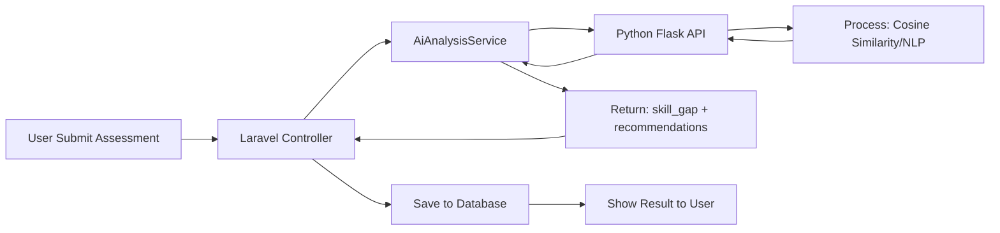

Untuk menguji apakah integrasi Python AI (Flask) berfungsi dengan baik, baik secara **standalone** maupun **terintegrasi dengan Laravel**, ikuti panduan lengkap berikut:

---

## 🧪 CARA TEST PYTHON AI MODULE

### 🔹 Langkah 1: Jalankan Python Flask Server

Pastikan Anda sudah menginstall dependency Python terlebih dahulu:

```bash
# Masuk ke folder ai-module
cd ai-module

# (Opsional) Buat virtual environment
python -m venv venv
# Windows:
venv\Scripts\activate
# Mac/Linux:
source venv/bin/activate

# Install dependency
pip install -r requirements.txt

# Jalankan server Flask
python app.py
```

Jika berhasil, Anda akan melihat output:
```
* Running on http://0.0.0.0:5000
* Press CTRL+C to quit
```

---

### 🔹 Langkah 2: Test Endpoint AI Langsung (Tanpa Laravel)

Gunakan **cURL** atau **Postman** untuk mengirim request ke endpoint `/analyze`.

**Contoh cURL:**
```bash
curl -X POST http://localhost:5000/analyze \
  -H "Content-Type: application/json" \
  -d '{
    "user_cv_text": "Saya berpengalaman di Python dan SQL",
    "user_assessment": {
      "Python": 3,
      "SQL": 4,
      "SEO": 2
    },
    "target_position": "Data Analyst"
  }'
```

**Contoh Response yang Diharapkan:**
```json
{
  "skill_gap": [
    {
      "skill": "SEO",
      "user_level": 2,
      "target_level": 4,
      "gap_percentage": 50.0,
      "priority": "medium"
    }
  ],
  "recommendations": [
    {
      "skill": "SEO",
      "course_title": "Mastering SEO",
      "platform": "Coursera",
      "priority": "medium"
    }
  ],
  "matching_scores": {
    "overall": 75.5
  }
}
```

✅ Jika response muncul seperti di atas, berarti **Python AI Module BERHASIL berjalan**.

---

### 🔹 Langkah 3: Test Integrasi dari Laravel

Buat **Route & Controller** khusus untuk testing integrasi.

#### A. Buat Test Route
**File:** `routes/web.php` (hanya untuk development)
```php
Route::get('/test-ai', function() {
    return view('test-ai');
});
```

#### B. Buat View Test
**File:** `resources/views/test-ai.blade.php`
```html
<x-app-layout>
    <div class="py-8">
        <div class="max-w-4xl mx-auto sm:px-6 lg:px-8">
            <h2 class="text-2xl font-bold mb-6">🧪 Test AI Integration</h2>
            
            <div class="bg-white rounded-xl shadow p-6">
                <form action="{{ route('test-ai.run') }}" method="POST">
                    @csrf
                    <div class="space-y-4">
                        <div>
                            <label class="block text-sm font-medium text-gray-700">Target Position</label>
                            <input type="text" name="target_position" value="Data Analyst" 
                                class="mt-1 block w-full rounded-md border-gray-300 shadow-sm focus:border-blue-500">
                        </div>
                        <div>
                            <label class="block text-sm font-medium text-gray-700">User Assessment (JSON)</label>
                            <textarea name="user_assessment" rows="6" 
                                class="mt-1 block w-full rounded-md border-gray-300 shadow-sm focus:border-blue-500 font-mono text-sm">{
  "Python": 3,
  "SQL": 4,
  "SEO": 2,
  "Communication": 5
}</textarea>
                        </div>
                        <button type="submit" class="px-6 py-3 bg-blue-600 text-white rounded-lg hover:bg-blue-700">
                            🚀 Run AI Analysis
                        </button>
                    </div>
                </form>

                @if(session('ai_response'))
                    <div class="mt-8 p-4 bg-gray-50 rounded-lg border">
                        <h4 class="font-bold mb-2">📊 Response dari AI:</h4>
                        <pre class="text-xs overflow-x-auto">{{ json_encode(session('ai_response'), JSON_PRETTY_PRINT) }}</pre>
                    </div>
                @endif

                @if(session('error'))
                    <div class="mt-4 p-4 bg-red-50 border border-red-200 rounded-lg text-red-700">
                        ❌ Error: {{ session('error') }}
                    </div>
                @endif
            </div>
        </div>
    </div>
</x-app-layout>
```

#### C. Buat Test Controller
**File:** `app/Http/Controllers/TestAiController.php`
```bash
php artisan make:controller TestAiController
```

```php
<?php
namespace App\Http\Controllers;

use App\Services\AiAnalysisService;
use Illuminate\Http\Request;
use Illuminate\Support\Facades\Log;

class TestAiController extends Controller
{
    public function run(Request $request, AiAnalysisService $aiService)
    {
        try {
            $assessmentData = [
                'user_cv_text' => 'Test CV content',
                'user_assessment' => json_decode($request->user_assessment, true),
                'target_position' => $request->target_position,
            ];

            Log::info('Sending to AI:', $assessmentData);
            
            $result = $aiService->analyzeAssessment($assessmentData);
            
            if ($result) {
                Log::info('AI Response:', $result);
                return back()->with('ai_response', $result)->with('success', '✅ AI Analysis Berhasil!');
            } else {
                return back()->with('error', '⚠️ AI tidak merespon, menggunakan fallback.');
            }
            
        } catch (\Exception $e) {
            Log::error('AI Test Error: ' . $e->getMessage());
            return back()->with('error', '❌ Error: ' . $e->getMessage());
        }
    }
}
```

#### D. Tambahkan Route untuk Test
**File:** `routes/web.php`
```php
Route::post('/test-ai/run', [TestAiController::class, 'run'])->name('test-ai.run');
```

---

### 🔹 Langkah 4: Jalankan Test di Browser

1.  Pastikan **Flask server** berjalan di port 5000
2.  Pastikan **Laravel server** berjalan di port 8000
3.  Buka browser: `http://127.0.0.1:8000/test-ai`
4.  Klik tombol **"🚀 Run AI Analysis"**
5.  Cek hasil response yang muncul di halaman

---

### 🔹 Langkah 5: Debug Jika Tidak Berfungsi

#### ❌ Masalah 1: Flask Server Tidak Bisa Diakses
```bash
# Test koneksi dari terminal Laravel
curl http://localhost:5000/analyze -X POST \
  -H "Content-Type: application/json" \
  -d '{"test": true}'
```

**Solusi:**
- Pastikan Flask running: `python app.py`
- Cek firewall/port blocking
- Coba ganti host di `ai-module/app.py`:
  ```python
  app.run(host='127.0.0.1', port=5000, debug=True)
  ```

#### ❌ Masalah 2: Laravel Tidak Bisa Connect ke Flask
Cek `config/services.php`:
```php
'ai' => [
    'endpoint' => env('AI_SERVICE_ENDPOINT', 'http://127.0.0.1:5000/analyze'),
],
```

Pastikan `.env` Laravel:
```env
AI_SERVICE_ENDPOINT=http://127.0.0.1:5000/analyze
```

#### ❌ Masalah 3: Timeout atau Error 500
Cek log Laravel:
```bash
tail -f storage/logs/laravel.log
```

Tambahkan timeout lebih panjang di `AiAnalysisService.php`:
```php
$response = Http::timeout(60)->post($this->aiEndpoint, $assessmentData);
```

---

### 🔹 Langkah 6: Verifikasi Data Flow Lengkap



**Cek Database setelah test:**
```bash
php artisan tinker
>>> App\Models\UserCompetencyScore::latest()->first();
// Pastikan data gap_percentage dan priority terisi dari AI
```

---

### 🔹 Langkah 7: Test Fallback Mechanism (Jika AI Down)

Matikan Flask server, lalu jalankan test lagi dari Laravel. Sistem harus tetap bekerja menggunakan **fallback rule-based**:

```php
// Di AiAnalysisService.php
catch (\Exception $e) {
    return $this->fallbackAnalysis($assessmentData); // Ini harus jalan
}
```

Jika fallback bekerja, Anda akan mendapat response default:
```json
{
  "skill_gap": [],
  "recommendations": [],
  "matching_scores": {"overall": 70}
}
```

---

## 📋 CHECKLIST TESTING

| No | Test | Status |
|----|------|--------|
| 1 | Flask server running di port 5000 | ☐ |
| 2 | cURL ke `/analyze` return JSON valid | ☐ |
| 3 | Laravel bisa HTTP POST ke Flask | ☐ |
| 4 | Response AI masuk ke database | ☐ |
| 5 | Fallback bekerja saat AI down | ☐ |
| 6 | Log error tercatat di `storage/logs/` | ☐ |

---

## 🚀 BONUS: Docker Setup untuk AI Module (Opsional)

Jika ingin menjalankan Python AI dalam container:

**File:** `ai-module/Dockerfile`
```dockerfile
FROM python:3.11-slim
WORKDIR /app
COPY requirements.txt .
RUN pip install -r requirements.txt
COPY . .
EXPOSE 5000
CMD ["python", "app.py"]
```

**File:** `docker-compose.yml` (di root Laravel)
```yaml
services:
  laravel:
    # ... config laravel ...
  
  ai-service:
    build: ./ai-module
    ports:
      - "5000:5000"
    environment:
      - FLASK_ENV=development
```

Jalankan:
```bash
docker-compose up -d ai-service
```

Update `.env`:
```env
AI_SERVICE_ENDPOINT=http://ai-service:5000/analyze
```

---

## ✅ KESIMPULAN

Jika semua langkah di atas berhasil:
- ✅ Python Flask AI berjalan di port 5000
- ✅ Laravel bisa mengirim data dan menerima response
- ✅ Data skill gap & rekomendasi tersimpan di database
- ✅ Fallback mechanism bekerja saat AI down

Maka integrasi Python AI Anda **SUDAH BERFUNGSI DENGAN BAIK**! 🎉

Silakan test dan beri tahu jika ada kendala di langkah tertentu! 🚀