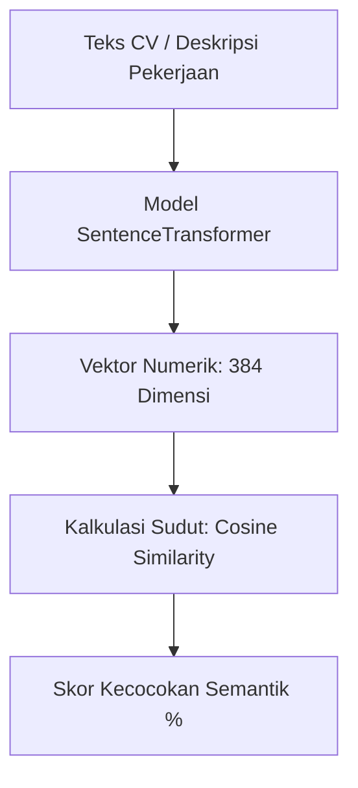
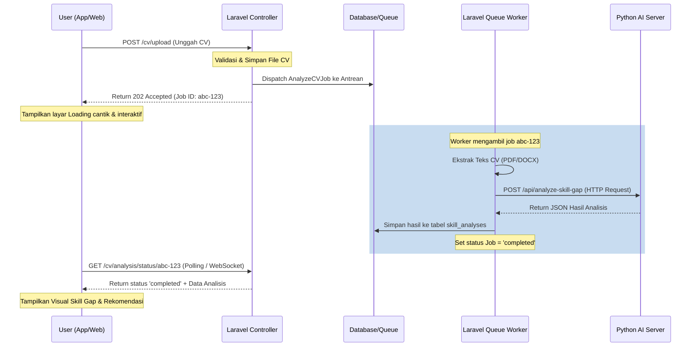

# 🚀 Proposal Arsitektur AI Tingkat Lanjut: Pencarian Vektor Semantik & Asynchronous Queue

Dokumen ini menyajikan rancangan arsitektur tingkat lanjut untuk meningkatkan **akurasi analisis kecocokan kompetensi** dan **responsivitas performa aplikasi** KompasKarir. 

Proposal ini dirancang untuk mengatasi keterbatasan pada arsitektur saat ini (pencocokan kata berbasis kamus statis dan pemrosesan sinkronous yang rawan *timeout*).

---

## 📐 1. Peningkatan 1: Pencarian Vektor Semantik (Semantic Skill Search)

### 🔴 Masalah Saat Ini
Sistem AI Python (`ai-module/app.py`) saat ini menggunakan pencocokan kata secara harfiah (string matching) dengan kamus statis `SKILL_VECTORS` (baris 30-36).
* **Kelemahan**: Jika CV pengguna menuliskan *"Data Wrangling"* atau *"Pengolahan Data"*, sistem tidak akan mendeteksinya sebagai skill yang relevan dengan *"SQL"* atau *"Python"* karena kecocokan kata secara harfiah bernilai `0`.

### 🟢 Solusi Arsitektur Baru
Mengganti string matching dengan **Dense Vector Embeddings** menggunakan model NLP pra-terlatih seperti **SentenceTransformers** (misalnya `paraphrase-multilingual-MiniLM-L12-v2` yang sangat dioptimalkan untuk bahasa Indonesia dan Inggris).



#### Contoh Implementasi Baru di Python (`ai-module/services/skill_gap_analyzer.py`):
```python
from sentence_transformers import SentenceTransformer
from sklearn.metrics.pairwise import cosine_similarity
import numpy as np

class SemanticGapAnalyzer:
    def __init__(self):
        # Menggunakan model ringan berkinerja tinggi yang mendukung bahasa Indonesia
        self.model = SentenceTransformer('sentence-transformers/paraphrase-multilingual-MiniLM-L12-v2')

    def calculate_semantic_similarity(self, user_skill_text: str, target_skill_text: str) -> float:
        """
        Menghitung kesamaan makna kata, meskipun kosa katanya berbeda.
        Contoh: "Manajemen Basis Data" vs "Database Administration" -> Similarity > 0.85
        """
        embeddings = self.model.encode([user_skill_text, target_skill_text])
        similarity = cosine_similarity([embeddings[0]], [embeddings[1]])
        return float(similarity[0][0])
```

#### Keuntungan:
* **Akurasi Tinggi**: Mampu mengenali sinonim, singkatan, dan perbedaan bahasa (Indonesian-English cross-lingual matching).
* **Fleksibel**: Tidak memerlukan pemeliharaan kamus kata kunci secara manual.

---

## ⏱️ 2. Peningkatan 2: Pemrosesan Antrean Latar Belakang (Asynchronous Queue Jobs)

### 🔴 Masalah Saat Ini
Saat user mengunggah berkas CV (PDF/DOCX) berukuran besar:
1. Laravel menerima file, membaca teks.
2. Laravel melakukan request HTTP sinkronous ke Python.
3. Python melakukan NLP parsing dan pencocokan semantik (proses ini memakan waktu 3 - 8 detik bergantung pada load server).
4. Laravel menunggu koneksi terbuka hingga respons kembali, baru kemudian merespons user.
* **Kelemahan**: Pengguna terjebak pada layar loading web/mobile dalam waktu lama. Jika koneksi terganggu, akan terjadi **Nginx Gateway Timeout (504)**.

### 🟢 Solusi Arsitektur Baru
Menerapkan pola **Asynchronous Job Queue** di Laravel menggunakan basis data atau Redis sebagai driver antrean.



#### Langkah Implementasi di Laravel:

##### Langkah A: Buat Class Job Asinkronous
```bash
php artisan make:job AnalyzeCVJob
```

##### Langkah B: Struktur Kode Job (`app/Jobs/AnalyzeCVJob.php`)
```php
<?php

namespace App\Jobs;

use App\Models\SkillAnalysis;
use App\Services\PythonAIService;
use Illuminate\Bus\Queueable;
use Illuminate\Contracts\Queue\ShouldQueue;
use Illuminate\Foundation\Bus\Dispatchable;
use Illuminate\Queue\InteractsWithQueue;
use Illuminate\Queue\SerializesModels;
use Illuminate\Support\Facades\Log;

class AnalyzeCVJob implements ShouldQueue
{
    use Dispatchable, InteractsWithQueue, Queueable, SerializesModels;

    protected $userId;
    protected $cvText;
    protected $targetPosition;
    protected $jobId;

    public function __construct($userId, $cvText, $targetPosition, $jobId)
    {
        $this->userId = $userId;
        $this->cvText = $cvText;
        $this->targetPosition = $targetPosition;
        $this->jobId = $jobId;
    }

    public function handle(PythonAIService $pythonAIService)
    {
        try {
            // Update status job di DB menjadi 'processing'
            // ...

            // Kirim ke Microservice AI Python
            $analysisResult = $pythonAIService->analyzeSkillGap([
                'cv_text' => $this->cvText,
                'target_position' => $this->targetPosition,
                'user_id' => $this->userId
            ]);

            // Simpan Hasil Analisis
            SkillAnalysis::create([
                'user_id' => $this->userId,
                'job_id' => $this->jobId, // Relasi ID transaksi
                'cv_text' => $this->cvText,
                'extracted_skills' => json_encode($analysisResult['extracted_skills']),
                'target_skills' => json_encode($analysisResult['target_skills']),
                'skill_gap' => json_encode($analysisResult['skill_gap']),
                'gap_percentage' => $analysisResult['gap_percentage'],
                'recommendations' => json_encode($analysisResult['recommendations']),
                'status' => 'completed'
            ]);

        } catch (\Exception $e) {
            Log::error('Gagal memproses antrean CV: ' . $e->getMessage());
            // Set status job = 'failed' di database
        }
    }
}
```

##### Langkah C: Controller Mengembalikan Respons Instan (`CVAnalysisController.php`)
```php
public function uploadAndAnalyze(UploadCVRequest $request, CVAnalysisService $cvAnalysisService)
{
    $jobId = uniqid('cv_job_');

    // Proses simpan & ekstraksi teks dasar dilakukan sinkronous (sangat cepat)
    $cvPath = $request->file('cv_file')->store('cvs', 'public');
    $cvText = $cvAnalysisService->extractTextOnly(storage_path('app/public/' . $cvPath), $request->file('cv_file')->getClientOriginalExtension());

    // Masukkan tugas NLP & AI ke dalam Antrean Latar Belakang (Asynchronous)
    AnalyzeCVJob::dispatch($request->user_id, $cvText, $request->target_position, $jobId);

    // Kirim respons 202 Accepted secara instan (Kurang dari 0.1 detik!)
    return response()->json([
        'success' => true,
        'message' => 'CV berhasil diunggah dan sedang dianalisis di latar belakang.',
        'job_id' => $jobId,
        'status' => 'queued'
    ], 202);
}
```

---

## 📈 3. Perbandingan Arsitektur: Lama vs Baru

| Dimensi | Arsitektur Saat Ini (Sinkronous & Dictionary-based) | Arsitektur Baru (Asinkronous & Semantic-based) |
| :--- | :--- | :--- |
| **Akurasi Pencocokan** | Rendah (Hanya kata yang sama persis terdeteksi). | Tinggi (Menghitung makna bahasa Indonesia & Inggris). |
| **Beban Server (Laravel)** | Tinggi (Thread server tertahan menunggu API Python). | Sangat Ringan (Respons langsung kembali dalam < 100ms). |
| **Pengalaman Pengguna (UI/UX)**| Rawan patah/loading beku di web & Flutter. | Halus (Progress bar real-time yang memanjakan mata). |
| **Ketahanan Gangguan** | Jelek (Jika server AI mati saat upload, request web gagal).| Bagus (Jika server AI mati, tugas antrean akan mengantre dan memproses ulang secara otomatis). |

---

*Desain arsitektur di atas dirancang untuk memaksimalkan kepatuhan terhadap **Laravel Best Practices (Enterprise Level)** dan **UI/UX Premium**. Implementasi ini menjamin aplikasi KompasKarir siap diskalakan untuk melayani ribuan pengguna secara bersamaan.*
