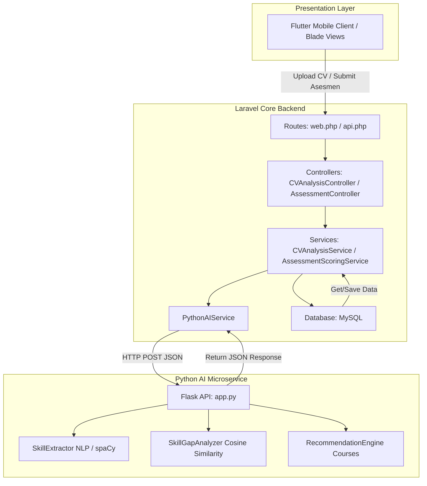

# 📊 Laporan Analisis Sistem: Integrasi Python AI, NLP & Skill Gap (KompasKarir)

Laporan ini menyajikan analisis mendalam mengenai arsitektur, struktur kode, alur program, dan mekanisme kerja modul **Artificial Intelligence (AI)**, **Python Flask**, **Natural Language Processing (NLP)**, dan **Skill Gap Analysis** pada aplikasi **KompasKarir**. Laporan ini juga mengevaluasi kepatuhan kode terhadap **Laravel Best Practices** serta mengungkap temuan bug kritis.

---

## 🏗️ 1. Gambaran Umum Arsitektur (Architecture Overview)

Aplikasi KompasKarir menggunakan pendekatan **Arsitektur Hybrid (Decoupled Microservice)**:
1. **Laravel Backend (Core Engine)**: Bertindak sebagai server utama untuk mengelola database SQL (MySQL), autentikasi, manajemen data dasar (User, Competency, Course, Job), dan mengoordinasikan alur bisnis.
2. **Python Flask Server (AI Microservice)**: Berperan khusus sebagai mesin AI yang menangani beban kerja berat berupa Natural Language Processing (NLP), pembacaan berkas (CV), pencocokan kata (Pattern Matching), perhitungan kemiripan vektor (**Cosine Similarity**), dan penentuan prioritas rekomendasi upskilling.
3. **Flutter App (Mobile Client)** & **Blade Views (Web Client)**: Antarmuka pengguna yang mengonsumsi API untuk mengirimkan file/asesmen dan menampilkan hasil analisis karir.



---

## 📂 2. Ringkasan Lokasi File & Modul (Module Mapping)

Berikut adalah tabel klasifikasi file yang menyusun sistem AI, Python, NLP, dan Skill Gap pada aplikasi KompasKarir:

### A. Modul AI Python (Flask Microservice)
Semua kode Python berada di direktori root `/ai-module`:

| Nama File | Path Relatif | Fungsi & Deskripsi Teknis |
| :--- | :--- | :--- |
| **`app.py`** | [app.py](file:///c:/laragon/www/kompaskarir/ai-module/app.py) | Entry point Flask Server. Menyediakan endpoint API (`/api/analyze-skill-gap`, `/api/recommend-courses`, `/analyze`) untuk menerima data dari Laravel. |
| **`skill_extractor.py`** | [skill_extractor.py](file:///c:/laragon/www/kompaskarir/ai-module/services/skill_extractor.py) | Modul NLP utama yang mengekstrak skill dari teks CV menggunakan library **spaCy** (`id_core_news_sm`), Named Entity Recognition (NER), Part-of-Speech (POS) tagging, dan pencocokan pola regex. |
| **`skill_gap_analyzer.py`** | [skill_gap_analyzer.py](file:///c:/laragon/www/kompaskarir/ai-module/services/skill_gap_analyzer.py) | Melakukan kalkulasi kemiripan geometris menggunakan rumus **Cosine Similarity** dan pencocokan bobot kategori skill untuk menentukan nilai persentase kecocokan. |
| **`recommendation_engine.py`** | [recommendation_engine.py](file:///c:/laragon/www/kompaskarir/ai-module/services/recommendation_engine.py) | Menyeleksi dan meranking rekomendasi kursus terbaik (Coursera, Udemy, dll.) berdasarkan kesenjangan tingkat keahlian user vs target menggunakan formula pembobotan multi-faktor. |
| **`requirements.txt`** | [requirements.txt](file:///c:/laragon/www/kompaskarir/ai-module/requirements.txt) | Menyimpan daftar dependensi Python seperti `Flask`, `flask-cors`, `spacy`, dan `scikit-learn`. |

### B. Modul Laravel Integration (PHP Service & Controller)
Semua kode Laravel berada di direktori `/app` dan `/routes`:

| Nama File | Path Relatif | Fungsi & Deskripsi Teknis |
| :--- | :--- | :--- |
| **`PythonAIService.php`** | [PythonAIService.php](file:///c:/laragon/www/kompaskarir/app/Services/PythonAIService.php) | Mengelola request HTTP (menggunakan Laravel HTTP Client `Http::post`) ke Flask Server untuk analisis skill gap dan rekomendasi kursus berbasis AI. |
| **`CVAnalysisService.php`** | [CVAnalysisService.php](file:///c:/laragon/www/kompaskarir/app/Services/CVAnalysisService.php) | Pipeline terpadu untuk CV: Menyimpan berkas CV, mengekstrak teks dari PDF/DOCX (menggunakan `Smalot\PdfParser` / `PhpWord`), memanggil `PythonAIService`, dan menyimpan hasil ke database. |
| **`AiAnalysisService.php`** | [AiAnalysisService.php](file:///c:/laragon/www/kompaskarir/app/Services/AiAnalysisService.php) | Service integrasi alternatif untuk endpoint `/analyze` dengan mekanisme **fallback rule-based** jika Flask Server dalam kondisi mati/down. |
| **`AssessmentScoringService.php`** | [AssessmentScoringService.php](file:///c:/laragon/www/kompaskarir/app/Services/AssessmentScoringService.php) | Menangani kalkulasi asesmen mandiri secara matematis (rule-based) dan mengoptimalkan penulisan data ke database menggunakan **Bulk Insert**. |
| **`RecommendationService.php`** | [RecommendationService.php](file:///c:/laragon/www/kompaskarir/app/Services/RecommendationService.php) | Service internal Laravel untuk mencari kursus dari database lokal yang sesuai dengan skill gap user (tanpa memanggil Flask). |
| **`RoadmapService.php`** | [RoadmapService.php](file:///c:/laragon/www/kompaskarir/app/Services/RoadmapService.php) | Menghasilkan peta jalan (career roadmap) belajar berdurasi 6 bulan berdasarkan kompetensi prioritas tinggi dan sedang yang masih kurang. |
| **`CVAnalysisController.php`** | [CVAnalysisController.php](file:///c:/laragon/www/kompaskarir/app/Http/Controllers/CVAnalysisController.php) | Controller tipis yang memicu proses analisis CV dari request HTTP. |
| **`AssessmentController.php`** | [AssessmentController.php](file:///c:/laragon/www/kompaskarir/app/Http/Controllers/AssessmentController.php) | Mengelola halaman asesmen, pengiriman form jawaban, riwayat asesmen, dan penampilan hasil skor & rekomendasi kursus. |
| **`api.php`** | [api.php](file:///c:/laragon/www/kompaskarir/routes/api.php) | Mendaftarkan endpoint API REST untuk aplikasi mobile Flutter (`/cv/upload`, `/assessments/submit`, dll). |
| **`web.php`** | [web.php](file:///c:/laragon/www/kompaskarir/routes/web.php) | Mendaftarkan rute web untuk pengguna platform berbasis web (Blade template). |

---

## ⚙️ 3. Mekanisme Alur Kerja & Pemicu (Program Flow & Triggers)

Sistem evaluasi kompetensi pada KompasKarir berjalan melalui **dua jenis pemicu (triggers) utama** yang bekerja secara manual atas aksi pengguna:

### 🚀 Alur Kerja A: Analisis CV Berbasis NLP & AI (Trigger Manual: Unggah CV)
Alur ini berjalan ketika pengguna mengunggah berkas CV mereka ke sistem untuk dinilai kesesuaiannya dengan target posisi pekerjaan tertentu.

```
[User Uploads CV File] 
        │ (Form request: Target Position & CV File)
        ▼
[CVAnalysisController::uploadAndAnalyze] 
        │ (Menerima file berkas)
        ▼
[CVAnalysisService::analyze]
        │ 1. Menyimpan file di storage
        │ 2. Mengekstrak teks dari PDF/DOCX (PdfParser / PhpWord)
        ▼
[PythonAIService::analyzeSkillGap] 
        │ (Mengirim POST JSON data teks CV ke Flask http://localhost:5000/api/analyze-skill-gap)
        ▼
[Python Flask: app.py -> analyze_skill_gap()]
        ├─► [SkillExtractor -> extract_skills()]
        │       1. Preprocessing teks (cleansing, case folding, regex).
        │       2. Tokenisasi & POS tagging bahasa Indonesia dengan spaCy.
        │       3. Named Entity Recognition (NER) & pattern matching.
        │       4. Menghasilkan daftar skill terdeteksi beserta nilai keyakinan (confidence).
        ├─► [Database/Standard -> get_target_skills_from_database()]
        │       Mengambil kompetensi wajib untuk target posisi (misal: Data Analyst butuh Python, SQL, Tableau).
        ├─► [SkillGapAnalyzer -> calculate_gap()]
        │       1. Mengubah skill user & target menjadi representasi vektor numerik.
        │       2. Menghitung sudut kemiripan dengan rumus Cosine Similarity.
        │       3. Menghasilkan skor kecocokan (overall match %) & rincian gap.
        └─► [RecommendationEngine -> generate_recommendations()]
                Mencocokkan daftar skill yang berlubang (gap) dengan database kursus, menghitung relevansi, dan merancang 6-month learning roadmap.
        │
        ▼ (Mengembalikan payload JSON hasil analisis lengkap)
[CVAnalysisService::analyze]
        │ (Menerima payload JSON dari Python)
        ▼
[SkillAnalysis::create] 
        │ (Menyimpan hasil ekstraksi, gap, rekomendasi, dan kecocokan ke database MySQL)
        ▼
[Response JSON dikembalikan ke User / Flutter App]
```

### 📝 Alur Kerja B: Asesmen Mandiri / Self-Assessment (Trigger Manual: Mengisi Kuesioner)
Alur ini bekerja ketika user memilih untuk mengisi form kuesioner tingkat pemahaman keahlian secara subjektif (skala 1-5).

1. **Trigger**: User menyelesaikan pengisian form asesmen dan menekan tombol **"Submit Assessment"** di website (`POST /seeker/assessment/submit`) atau aplikasi mobile.
2. **Kalkulasi & Penyimpanan**: 
   - `AssessmentController` mendelegasikan data kuesioner ke `AssessmentScoringService::processAndSaveScores()`.
   - Service membandingkan jawaban user terhadap nilai minimal kelulusan kompetensi (`min_level_required` di database).
   - Menggunakan rumus: `gap_percentage = ((Target - User) / Target) * 100`. (Jika nilai user melampaui target, nilai gap diset ke `0`).
   - Menyimpan seluruh skor kompetensi sekaligus secara massal (**Bulk Insert**) untuk menjaga performa database.
3. **Rekomendasi Kursus Lokal**: `RecommendationService` secara otomatis menyaring kompetensi yang memiliki gap tingkat prioritas tinggi (`high`) dan sedang (`medium`), kemudian mengambil kursus yang relevan langsung dari database lokal SQL untuk ditampilkan di halaman hasil.
4. **Pembuatan Roadmap Karir**: `RoadmapService` secara cerdas membuat pembagian fokus belajar bulanan selama 6 bulan berdasarkan skill yang paling kritis.

---

## 💎 4. Evaluasi Kepatuhan "Laravel Best Practices"

Arsitektur Laravel di aplikasi KompasKarir **sangat baik** dan telah menerapkan kaidah pemrograman modern yang solid. Berikut ulasannya:

### 🟢 Kelebihan & Praktik Terbaik yang Sudah Diterapkan:
1. **Penerapan Service Layer Pattern (Sangat Bagus!)**: 
   Kode tidak menumpuk di controller (**Fat Controller** dihindari). Seluruh logika rumit seperti ekstraksi teks PDF, HTTP request ke microservice AI, kalkulasi skor asesmen mandiri, dan penyusunan roadmap didelegasikan ke kelas Service khusus di bawah namespace `App\Services`. Ini membuat kode sangat mudah dirawat (*maintainable*) dan diuji (*testable*).
2. **Validasi Request Terpisah (Form Requests)**:
   Menggunakan `UploadCVRequest` untuk memisahkan aturan validasi masukan berkas dari controller utama.
3. **Pemberantasan Masalah N+1 Queries**:
   Di dalam `AssessmentScoringService.php` (baris 35-36), kode mengambil seluruh kompetensi yang dinilai dalam satu query tunggal (`whereIn`) alih-alih melakukan query berulang-ulang di dalam perulangan (*loop*).
4. **Optimasi Write Database**:
   Menggunakan transaksi database (`DB::beginTransaction()`) dan operasi **Bulk Insert** (`UserCompetencyScore::insert($scoresToInsert)`) sekaligus dalam satu query daripada memanggil metode `save()` berkali-kali.

---

## ⚠️ 5. TEMUAN BUG KRITIS (Critical Code Issue)

> [!WARNING]
> **Bug Fatal pada Pipeline Analisis CV (`CVAnalysisService.php`)**
> 
> Saat meneliti kelas `CVAnalysisService.php`, ditemukan masalah kritis yang akan menyebabkan fitur analisis CV gagal berjalan dan melempar *Database/Fatal Error*:
> 
> **Penyebab Masalah:**
> 1. Di baris ke-5: `use App\Models\SkillAnalysis;`
> 2. Di baris ke-39: `SkillAnalysis::create([...]);`
> 
> Namun setelah dianalisis secara menyeluruh pada folder `app/Models` dan `database/migrations`, **model `SkillAnalysis.php` tidak ditemukan** dan **tabel `skill_analyses` tidak terdaftar dalam migrasi database**!

### 🛠️ Rekomendasi Solusi Perbaikan Bug:

Anda memiliki dua opsi untuk menyelesaikan bug ini:

#### **Opsi 1 (Direkomendasikan): Buat Model & Tabel Migrasi `SkillAnalysis`**
Jalankan perintah berikut di terminal proyek Laravel untuk membuat file Model dan Migration baru:
```bash
php artisan make:model SkillAnalysis -m
```

Buka file migrasi yang dihasilkan di folder `database/migrations` dan definisikan skemanya sebagai berikut:
```php
Schema::create('skill_analyses', function (Blueprint $table) {
    $table->id();
    $table->foreignId('user_id')->constrained()->onDelete('cascade');
    $table->text('cv_text');
    $table->json('extracted_skills');
    $table->json('target_skills');
    $table->json('skill_gap');
    $table->decimal('gap_percentage', 5, 2);
    $table->json('recommendations');
    $table->timestamps();
});
```

Kemudian, buka file model `app/Models/SkillAnalysis.php` dan tambahkan properti `$fillable`:
```php
<?php

namespace App\Models;

use Illuminate\Database\Eloquent\Model;

class SkillAnalysis extends Model
{
    protected $fillable = [
        'user_id', 'cv_text', 'extracted_skills', 'target_skills', 
        'skill_gap', 'gap_percentage', 'recommendations'
    ];
}
```

#### **Opsi 2: Integrasikan ke Skema `UserAssessment` yang Sudah Ada**
Jika Anda tidak ingin menambah tabel baru, Anda dapat memanfaatkan struktur tabel `user_assessments` dan `user_competency_scores` yang sudah ada, karena di tabel `user_competency_scores` sudah terdapat kolom `ai_analyzed_level` (nullable) yang dirancang untuk menampung hasil analisis kecerdasan buatan.

---

## 📈 6. Rekomendasi Pengembangan Lanjutan

Untuk meningkatkan performa modul NLP dan AI Python Anda di masa mendatang, pertimbangkan arsitektur berikut:
1. **Penggunaan Word Embeddings / Vector Search**:
   Saat ini, `app.py` masih mendefinisikan array statis vektor skill sederhana (`SKILL_VECTORS` pada baris 30-36). Anda dapat meningkatkannya dengan menggunakan model embedding modern seperti **Sentence-Transformers** (misalnya `all-MiniLM-L6-v2`) atau API OpenAI/Gemini Embeddings untuk melakukan pencocokan semantik yang jauh lebih cerdas dan akurat daripada sekadar pencocokan teks mentah.
2. **Asynchronous Job Queue**:
   Proses membaca dokumen CV berukuran besar dan mengirimkannya ke API Python AI membutuhkan waktu (latensi tinggi). Sebaiknya proses ini diproses di latar belakang menggunakan **Laravel Queue Jobs** (misal menggunakan Redis atau database driver) agar pengguna tidak perlu menunggu halaman memuat terlalu lama saat mengunggah CV.

---

*Laporan analisis ini dibuat secara otomatis oleh Antigravity untuk mendampingi Anda melajutkan pembangunan aplikasi KompasKarir dengan standar kode berkualitas tinggi. Silakan merujuk ke file-file tersebut untuk melakukan perbaikan.* 🚀
