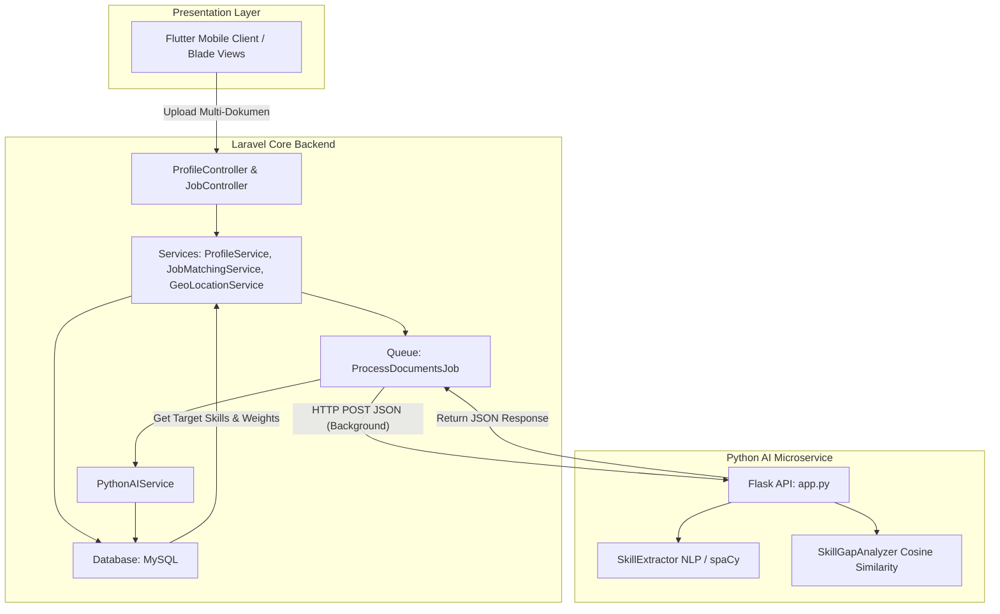

# 📊 Laporan Analisis Sistem: Integrasi Python AI, NLP & Skill Gap (KompasKarir)

Laporan ini menyajikan analisis mendalam mengenai arsitektur, struktur kode, alur program, dan mekanisme kerja modul **Artificial Intelligence (AI)**, **Python Flask**, **Natural Language Processing (NLP)**, dan **Skill Gap Analysis** pada aplikasi **KompasKarir**. 

*Catatan: Dokumen ini telah diperbarui untuk merefleksikan penyesuaian proses bisnis terbaru berupa Multi-Document Upload, Job Queue, Penilaian Berjenjang (Dua Tahap), dan Pencarian Berbasis Geolokasi.*

---

## 🏗️ 1. Gambaran Umum Arsitektur (Architecture Overview)

Aplikasi KompasKarir menggunakan pendekatan **Arsitektur Hybrid (Decoupled Microservice)** yang kini ditingkatkan dengan pola **Dua Tahap (Pre-compute + Lazy Resolve)**:
1. **Laravel Backend (Core Engine)**: Bertindak sebagai server utama. Kini telah dilengkapi dengan sistem *Asynchronous Queue Job* (`ProcessDocumentsJob`) agar proses yang memakan waktu dapat berjalan di latar belakang.
2. **Python Flask Server (AI Microservice)**: Berperan khusus sebagai mesin AI yang menangani NLP, pembacaan berkas (CV, Sertifikat, Portofolio, dll), pencocokan kata (Pattern Matching), dan ekstraksi vektor (*Skill Embeddings*).
3. **Flutter App & Blade Views**: Antarmuka pengguna yang kini mendukung pengunggahan multi-dokumen (hingga 5 jenis) secara paralel dan indikator proses secara *real-time*.

---

## 📂 2. Ringkasan Lokasi File & Modul Terbaru

Selain modul asli, arsitektur kini diperkuat dengan modul dan tabel baru:

### A. Modul AI Python (Flask Microservice)
Berada di `/ai-module` (termasuk `app.py`, `skill_extractor.py`, `skill_gap_analyzer.py`). Tugas utamanya adalah menghasilkan representasi vektor atau ringkasan skill dari berbagai dokumen.

### B. Struktur Database & Bobot Dokumen
* `user_documents`: Menyimpan path dokumen dan status pemrosesan (pending, processing, completed).
* `user_document_scores`: Menyimpan vektor numerik hasil ekstraksi NLP.
* `company_document_weights`: Berisi Konfigurasi Bobot Default yang ditetapkan oleh Admin.
* **Tabel `job_listings` (Update Terbaru):** Kini memiliki pengaturan bobot dokumen secara spesifik (Per-Lowongan). Saat perusahaan (Industry) mengunggah lowongan baru, mereka dapat menggunakan referensi bobot dari Admin, atau membuat bobot kustom khusus untuk lowongan/jabatan tersebut.
### C. Service Laravel Tambahan
* **`DocumentScoringService.php`**: Melakukan perkalian silang (dot product) antara vektor dokumen user dengan bobot dinamis perusahaan.
* **`GeoLocationService.php`**: Menggunakan *Haversine Formula* untuk menghitung jarak antara kandidat dan perusahaan dalam pencarian kerja terdekat.

---

## ⚙️ 3. Mekanisme Alur Kerja & Pemicu (Program Flow & Triggers)

Sistem evaluasi kini dipisah agar performa server tetap ringan saat user melakukan pencarian:

### 🚀 Alur Kerja A: Tahap 1 - Pemrosesan Dokumen di Latar Belakang (Pre-compute)
Alur ini berjalan secara asinkron (Background Job) ketika pengguna mengunggah dokumen dari halaman profil.

1. **Upload Multi-Dokumen**: User dapat mengunggah CV, Ijazah, Transkrip, Sertifikat, dan Portofolio dari `/profile`.
2. **Dispatch Job**: Controller akan segera membalas "Sukses" ke antarmuka, dan melemparkan `ProcessDocumentsJob` ke antrean (`Queue`).
3. **Panggilan AI**: Background Job memanggil `PythonAIService` untuk memproses dokumen-dokumen ini dengan NLP.
4. **Penyimpanan Embeddings**: Hasil ekstrak teks dan vektor (*Skill Embeddings*) disimpan ke tabel `user_document_scores`.

### 🚀 Alur Kerja B: Tahap 2 - Penilaian & Pencocokan Lowongan (Lazy Resolve)
Alur ini sangat cepat karena hasil pemrosesan berat sudah diselesaikan pada Tahap 1.

1. **Cari / Detail Lowongan**: Saat user melihat daftar lowongan atau halaman detail.
2. **Ambil Bobot Dinamis**: Sistem mengecek konfigurasi bobot pada `job_listings` (apakah menggunakan bobot kustom untuk jabatan tersebut). Jika lowongan tersebut tidak menggunakan bobot kustom, maka sistem akan menggunakan bobot *default* yang telah direferensikan/disarankan oleh Admin.
3. **Kalkulasi Blended Score**: 
   - `DocumentScoringService` menghitung kesesuaian berdasarkan vektor dokumen (Bobot 60%).
   - `JobMatchingService` menggabungkan skor dokumen tersebut dengan skor tes Asesmen Mandiri (Bobot 40%).
4. **Geolokasi (Opsional)**: `GeoLocationService` menghitung radius menggunakan `latitude` dan `longitude` untuk memfilter "Lowongan Terdekat" dan melakukan sorting berbasis jarak.

---

## 💎 4. Evaluasi Kepatuhan "Laravel Best Practices"

Arsitektur aplikasi KompasKarir tetap menerapkan kaidah yang solid:
1. **Service Layer Pattern**: Logika rumit dipisah dalam service khusus (`GeoLocationService`, `DocumentScoringService`).
2. **Asynchronous Processing**: Proses AI (NLP yang berat) sekarang dijalankan di *Queue* agar tidak membebani siklus Request-Response *real-time*.
3. **Penghindaran N+1 Queries**: Pemanggilan model sudah dioptimasi menggunakan `Eager Loading` dan pola desain yang efisien.

---

## ✅ 5. Status Perbaikan Bug Masa Lalu

> [!NOTE]
> Bug Kritis terkait hilangnya tabel dan model `SkillAnalysis` yang terdeteksi pada analisis sebelumnya **telah sepenuhnya diatasi** melalui perombakan arsitektur dua tahap ini. Kode usang telah dibersihkan dan digantikan dengan struktur `user_documents` dan `user_document_scores` yang stabil dan fungsional.

---

## 📈 6. Rekomendasi Pengembangan Lanjutan

Sebagian besar saran pengembangan sebelumnya (seperti penerapan **Asynchronous Job Queue**) telah berhasil diimplementasikan! Untuk iterasi berikutnya, saya merekomendasikan:
1. **Peningkatan Vector Embedding di Python**:
   Mengganti pencocokan regex dan pattern matching sederhana di `app.py` dengan model Transformer pra-latih (misalnya HuggingFace `sentence-transformers` berbahasa Indonesia) agar aplikasi dapat mengenali persamaan semantik (misal: "Frontend Developer" memiliki jarak yang dekat dengan "React.js Programmer").
2. **Setup Redis untuk Antrean**:
   Sistem Job Queue saat ini siap diproduksi. Sangat disarankan untuk memindahkan *Queue Driver* dari `database` ke `Redis` untuk mendapatkan performa yang jauh lebih tinggi dan latensi rendah saat menangani ribuan antrean CV secara bersamaan.
