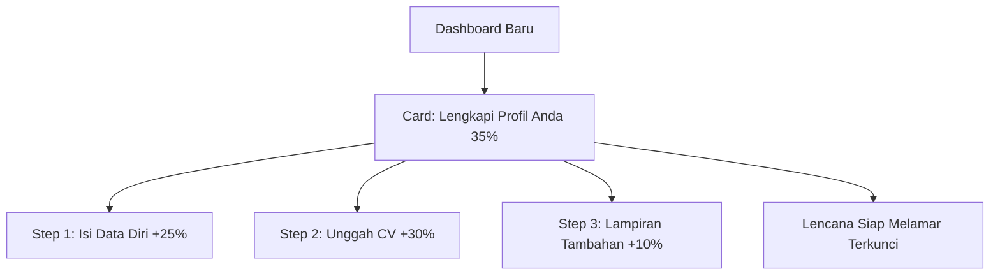

# Rekomendasi UI/UX Best Practices: Onboarding & Profile Gating (Job Seeker)

Ketika pengguna baru (*job seeker*) pertama kali masuk ke dashboard, mereka biasanya merasa kewalahan atau bingung tentang apa yang harus dilakukan selanjutnya. Untuk meningkatkan **retensi pengguna** dan memastikan mereka **melengkapi profil** (data diri, CV, lampiran) tanpa merasa terpaksa, berikut adalah strategi UI/UX terbaik yang dapat kita terapkan.

---

## 1. Konsep Utama: "Gamified Checklist & Friendly Gating"

Alih-alih mengunci sistem secara agresif dengan pesan error atau memblokir akses secara kasar, gunakan pendekatan **Gamifikasi (Gamification)** dan **Bimbingan Progresif (Progressive Disclosure)**.

### A. Widget Progress Tracker (Lencana Progres)
Tempatkan widget dinamis di bagian paling atas dashboard. Pengguna sangat sensitif terhadap tugas yang belum selesai (efek *Zeigarnik*). Melihat progress bar di angka 30% akan mendorong mereka untuk menyelesaikannya hingga 100%.



### B. Strategi Gating yang Ramah (Smart Gating)
Jika pengguna mencoba mengklik menu "Cari Kerja" atau "Kursus" sebelum profilnya 100% lengkap, jangan gunakan halaman kosong atau alert standar. Tampilkan **Glassmorphism Modal** yang interaktif:
* **Penjelasan Nilai (Value Proposition):** *"Perusahaan butuh CV Anda untuk melihat kecocokan keahlian Anda. Lengkapi profil untuk membuka akses 150+ lowongan kerja aktif!"*
* **Call to Action (CTA) Utama:** *"Lengkapi Profil (Hanya 2 Menit) ➔"*

---

## 2. Pilihan Desain Komponen Dashboard

Berikut adalah beberapa alternatif komponen visual yang sangat direkomendasikan untuk diimplementasikan pada dashboard:

````carousel
### Opsi A: Banner & Checklist Interaktif (Sangat Direkomendasikan)
Sebuah komponen besar di bagian atas dashboard dengan latar belakang gradasi modern dan daftar tugas interaktif.

* **Desain:** Card dengan gradasi `bg-gradient-to-r from-blue-500 to-indigo-600` untuk mode terang, atau Slate gelap untuk mode gelap.
* **Elemen Visual:**
  * **Progress Bar:** Menampilkan persentase kesiapan profil secara visual.
  * **Checklist:** Daftar tugas interaktif yang otomatis tercentang jika selesai.
  * **Status Badge:** Lencana visual seperti "Akun Dasar" yang akan berubah menjadi "Kandidat Premium" setelah 100%.

```html
<!-- Contoh Struktur HTML/Tailwind -->
<div class="bg-white dark:bg-slate-800 rounded-2xl border dark:border-slate-700 shadow-xl p-6 mb-6">
    <div class="flex flex-col md:flex-row md:items-center justify-between gap-4 mb-6">
        <div>
            <span class="px-3 py-1 text-xs font-bold text-amber-600 bg-amber-50 dark:text-amber-400 dark:bg-amber-900/30 rounded-full border border-amber-200 dark:border-amber-800">
                ⚠️ Profil Belum Lengkap
            </span>
            <h3 class="text-xl font-bold text-gray-900 dark:text-white mt-3">Langkah Terakhir Sebelum Mulai Karirmu!</h3>
            <p class="text-sm text-gray-500 dark:text-slate-400 mt-1">Lengkapi profil Anda untuk membuka fitur pencarian kerja dan rekomendasi kursus otomatis.</p>
        </div>
        <div class="flex items-center gap-4">
            <div class="text-right">
                <span class="text-2xl font-black text-blue-600 dark:text-blue-400">40%</span>
                <p class="text-xs text-gray-400">Kekuatan Profil</p>
            </div>
            <div class="w-32 bg-gray-100 dark:bg-slate-700 rounded-full h-3">
                <div class="bg-gradient-to-r from-blue-500 to-indigo-600 h-3 rounded-full" style="width: 40%"></div>
            </div>
        </div>
    </div>
    <!-- Checklist -->
    <div class="grid grid-cols-1 md:grid-cols-3 gap-4">
        <!-- Step 1 -->
        <div class="p-4 rounded-xl border border-green-200 bg-green-50/50 dark:border-green-900/30 dark:bg-green-950/10 flex items-start gap-3">
            <div class="p-1 bg-green-500 text-white rounded-full">
                <svg class="w-4 h-4" fill="none" stroke="currentColor" viewBox="0 0 24 24"><path stroke-linecap="round" stroke-linejoin="round" stroke-width="3" d="M5 13l4 4L19 7"/></svg>
            </div>
            <div>
                <h4 class="font-semibold text-sm text-gray-900 dark:text-white">Verifikasi Akun</h4>
                <p class="text-xs text-gray-500">Selesai dilakukan</p>
            </div>
        </div>
        <!-- Step 2 -->
        <div class="p-4 rounded-xl border border-gray-200 dark:border-slate-700 flex items-start gap-3 hover:border-blue-300 dark:hover:border-blue-800 transition cursor-pointer">
            <div class="w-6 h-6 flex items-center justify-center border-2 border-blue-500 text-blue-500 rounded-full font-bold text-xs">2</div>
            <div class="flex-1">
                <h4 class="font-semibold text-sm text-gray-900 dark:text-white">Isi Data Diri & CV</h4>
                <p class="text-xs text-gray-500">Nama, Riwayat, Pendidikan</p>
                <a href="/profile/edit" class="text-xs font-bold text-blue-600 dark:text-blue-400 mt-1 inline-block hover:underline">Isi Sekarang →</a>
            </div>
        </div>
        <!-- Step 3 -->
        <div class="p-4 rounded-xl border border-gray-200 dark:border-slate-700 flex items-start gap-3">
            <div class="w-6 h-6 flex items-center justify-center border-2 border-gray-300 text-gray-400 rounded-full font-bold text-xs">3</div>
            <div>
                <h4 class="font-semibold text-sm text-gray-400 dark:text-slate-500">Unggah Lampiran</h4>
                <p class="text-xs text-gray-400">Sertifikat & Portofolio</p>
            </div>
        </div>
    </div>
</div>
```
<!-- slide -->
### Opsi B: Sistem Lencana Karir (Career Badge Gamification)
Pendekatan super-gamifikasi dengan memberikan pengguna tingkat "Kematangan Karir".

* **Konsep:**
  * **Level 1: Newbie Explorer 🥚** (Profil 0-30%) - Fitur pencarian terkunci.
  * **Level 2: Job Ready Candidate 🎯** (Profil 70-90%) - Bisa mencari kerja & mendeteksi skill gap.
  * **Level 3: Premium Applicant 🌟** (Profil 100%) - Profil diprioritaskan oleh HRD mitra, bisa otomatis apply sekali klik.
* **Kelebihan:** Mendorong psikologis pencapaian pengguna secara organik karena mereka tidak ingin merasa di level terendah.
<!-- slide -->
### Opsi C: Toast/Sticky Floating Banner
Banner dinamis kecil di bagian bawah layar yang terus mengambang secara presisten hingga profil dilengkapi.

* **Desain:** Elegan, dengan tombol minimalis di sudut kanan atau bawah layar.
* **Kelebihan:** Tidak memakan tempat di bagian tengah halaman utama dashboard, namun selalu terlihat kemanapun user menelusuri halaman.
````

---

## 3. Alur UX Mengatasi Skill Gap & Kursus

Sesuai kebutuhan sistem Anda: **"menjalankan kursus jika memiliki skill gap"**.
Berikut adalah alur UX terbaik ketika pengguna selesai mengisi profil:

1. **Selesai Upload Profil (100%)** ➔ Jalankan algoritma pencocokan data profil dengan standar industri.
2. **Dashboard Dinamis (State 2)** ➔ Widget Checklist hilang, diganti dengan **Analisis Kesiapan Karir**:
   * *"Skor kesiapan Anda untuk posisi **Laravel Developer**: **75%**"*
   * *"Terdapat **2 Skill Gap** yang harus dipenuhi: **Redis & Docker**"*
3. **Actionable Course Recommendation** ➔ Di bagian bawah analisis, berikan tombol:
   * **[Rekomendasi Kursus Redis]** (Tombol CTA berkedip/menonjol) ➔ *"Ambil Kursus Gratis untuk Menutup Gap ini"*

---

## 4. Rekomendasi Rencana Implementasi Teknis

Untuk Laravel + Blade + Tailwind yang sedang Anda gunakan:
* **State Management:** Simpan kolom `profile_completed_percentage` di tabel `users` (dihitung saat update profil) agar efisien dipanggil di View.
* **Blade Conditional Rendering:**
  ```blade
  @if(auth()->user()->profile_completed_percentage < 100)
      <!-- Render Opsi A: Banner & Checklist -->
  @else
      <!-- Render Dashboard Utama: Analisis Skill Gap & Cari Lowongan -->
  @endif
  ```
* **Middleware Gating:** Buat middleware `EnsureProfileIsCompleted` untuk rute `/jobs/apply` agar jika mereka mengakses langsung dari URL, mereka dilempar balik ke dashboard dengan flash message berisi modal pengingat.
